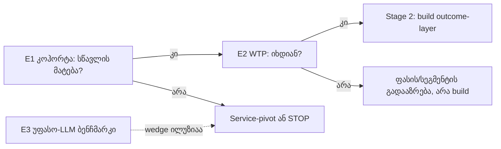

# NikoLearn · Stage 1: სტრატეგიული აუდიტი და თეზისი
**თარიღი:** 2026-07-16 · **მეთოდი:** 5 პარალელური აუდიტ-აგენტი (13 strategy .docx, docs/ vision ფაილები, კოდი, telemetry, გარე აუდიტები, კონკურენტები) + სინთეზი. **Prompt SSOT:** `STAGE1_PROMPT_v2.md`. **სტატუსი:** ელოდება დამფუძნებლის CONFIRM-ს (იხ. `STAGE1_DECISION_BRIEF_KA.md`).

## 0. ვერდიქტი ერთ აბზაცად
[FACT] პროდუქტი ცოცხალია (nikolearn.com v1.365), მაგრამ ცენტრალური თეზისი „AI tutoring ჩვენი differentiator-ია" დღეს ორმაგად დაუმტკიცებელია: (ა) runtime-ზე LLM tutoring საერთოდ არ არსებობს (tutor.js დეტერმინისტული, წინასწარ დაწერილი hint-ებით), (ბ) სწავლის outcome არცერთ ბავშვზე არ გაზომილა, გადამხდელი მომხმარებელი 0-ია, დაბრუნებადი მოწყობილობა 1-ია. [RECOMMENDATION, confidence ~75%] ვერდიქტი: CONDITIONAL-GO. არაფერი აშენდეს, სანამ 3 იაფი ექსპერიმენტი (§6) არ დაადასტურებს ან არ ჩაშლის თეზისს. არჩეული build-shape: ერთდომენიანი, outcome-ზე დამტკიცებული პროდუქტი (რეკომენდებული დომენი: ქართული ადრეული კითხვა, ასაკი 3-7). რეალური moat-კანდიდატი tutoring-დიალოგი კი არა, Outcome Engineering + საკუთრებული outcome-მონაცემია, მაგრამ ესეც [HYPOTHESIS], რომელსაც ექსპერიმენტები ამოწმებს.

---

## 1. დოკუმენტების აუდიტი (Task 1)

### 1.1 კორპუსის ვერდიქტი კლასტერებად
| კლასტერი | ფაილები | ვერდიქტი | სანდოობა |
|---|---|---|---|
| დამფუძნებლის ხაზი | Strategy v1.5→v1.6→Constitution v1.8→v1.9 | ავთენტური, კარგი ეპისტემიკით (hypothesis-ლეიბლები, Nikoloz ≠ validation), მაგრამ evidence decay: v1.5-ის რეალური ციფრები (20 ოჯახი, 0 გადამხდელი) შემდეგ ვერსიებში ქრება; v1.5-ის 30-დღიანი სპრინტის (50 ოჯახი) შედეგი არსად ჩანს | MED-HIGH, ერთადერთი ნამდვილი სტრატეგიული ჩანაწერი |
| 07-11 ტრიპლიკატი | AI-წიგნიერების სტრატეგია · მონეტიზაციის რეპორტი · Growth Roadmap | ერთი AI-thesis სამ ეგზემპლარად: „B2B Safe-AI teacher platform" pivot. შეიცავს ფაბრიცირებულ ADB-ატრიბუციას (ADB მშობელთა ქცევას არ იკვლევს), Virtual Zone-ის საგადასახადო შეცდომას (0% მხოლოდ ექსპორტზეა, ლოკალურ სკოლებზე არა) და პროდუქტის იდენტობის უჩუმარ გადაწერას | LOW. **QUARANTINE: გადაწყვეტილების input-ად არ გამოდგება** |
| Intel Report v2 | Strategic Intelligence Report v2 | baseline ჰალუცინირებულია: NikoLearn-ს მიაწერს B2B teacher-dashboard-ს, hardware-ს და ინვესტორებს, რაც არცერთ რეალურ დოკუმენტში არ არსებობს; „VERIFIED FACT" ტეგები დაუმტკიცებელია | LOW. **QUARANTINE**, გამოსადეგია მხოლოდ Izrune/GITA-ს გადამოწმებადი ფაქტები |
| ეკოსისტემის დოკები | Framework ×2 (byte-identical!) · Blueprint · ReverseEng · GeoEco | ხუთივე ერთი წყაროს (ADB, მარტი 2023) გადაფუთვაა; ურთიერთდადასტურება უფასურია. გლობალურ AI-tutor კონკურენციაზე (ChatGPT, Khanmigo, Duolingo) სრული სიჩუმე | LOW-MED, გამოსადეგი ამონაწერები §1.2-შია |
| docs/ (PRODUCT_IDEAS, ROADMAP, MISSION) | ცოცხალი გადაწყვეტილებების ჟურნალი | რეალურია, მაგრამ ატარებს გადაუჭრელ ფორკებს: 3 mission-ტექსტი, ორი ურთიერთგამომრიცხავი „LOCKED" სტრატეგია, PI-46 თვით-განაჩენი პლატფორმის ნარატივზე | HIGH როგორც ჩანაწერი, LOW როგორც თანმიმდევრული სტრატეგია |

### 1.2 რა ვიცით [FACT] (წყაროებით)
**პროდუქტი (კოდიდან, HANDOFF.md):** offline PWA, ~40 submode 8 საგანში; tutor = ალგორითმული, item-სპეციფიკური, პასუხს არასდროს ამხელს; runtime LLM არსად; პროგრესი მხოლოდ localStorage-ში; adaptive ramp არსებობს (≥85% level-up), მაგრამ ვალიდირებული assessment/mastery მოდელი არა; ქართული ხმა პლატფორმებზე ჩუმია (TTS არ არსებობს, კლიპების pipeline აწყობილია, კლიპები არ დაგენერირებულა).
**Usage (telemetry, 06-16→07-01):** page_view 390 · round_complete 399 · round_abandon 168 · profile 44-49 (tester-heavy) · abandon-ების 53% q0-ზე, easy-q0 ჰიპოთეზა უკვე FALSIFIED · პირველი retention-სიგნალი: ზუსტად 1 ტელეფონი · გადახდა 0 · მშობლის ინტერვიუ ჩატარებული 0 · W1 read დაგეგმილია 07-18-ზე.
**ბაზარი:** NODI (nodi.md): ქართული AI tutor სკოლის ასაკზე, ეროვნულ სასწავლო გეგმაზე, 69₾/თვე, GITA-ს მხარდაჭერით. ეს ადასტურებს ქართველი მშობლის გადახდის ნებას AI tutoring-ზე, ოღონდ სასკოლო-საგამოცდო ჭრილში, არა 3-7 ასაკზე. ლოკალურ EdTech-ში (Izrune, Lingwing, SchoolBook) AI-ინტეგრაცია 0-ია. B2C-შეზღუდვა: მოსახლეობის 84%-ს დანაზოგი არ აქვს (ADB). GITA-გრანტები რეალურია, მაგრამ კონკურენტული ფსონია და არა შემოსავალი.

### 1.3 მთავარი წინააღმდეგობები
| # | წინააღმდეგობა | მხარეები |
|---|---|---|
| 1 | ორი ერთდროულად „LOCKED" შეუთავსებელი მოდელი | 06-05: GE one-time unlock, no subscription ↔ 06-08: diaspora subscription platform |
| 2 | 3 mission-ტექსტი | MISSION-SLOGAN (confident/creative/independent) ↔ 06-08 diaspora-mission ↔ brand-კანდიდატი A (PI-12, არასდროს დალოკილა) |
| 3 | AI-ს როლი ერთ დღეში ბრუნდება | v1.6 „AI is the core capability" ↔ v1.8 (იმავე დღეს) „AI არასდროს ხდება პროდუქტი" |
| 4 | პლატფორმა ↔ ფოკუსი | D5 LOCKED „templatable heritage platform" ↔ PI-46 „აქ კვდება focus" (ორივე წიგნებშია, არავის შეურიგებია) |
| 5 | B2C პროდუქტი ↔ B2B დოკუმენტები | აშენებული პროდუქტი: მშობელი-ბავშვი B2C ↔ 07-11 ტრიპლიკატი: B2B teacher platform, არგუმენტის გარეშე |
| 6 | privacy-დაპირება ↔ outcome-გაზომვა | „ყველაფერი on-device, absolute" ↔ PI-77 (owner-ის ფორკი) + ის ფაქტი, რომ outcome-moat-ს longitudinal ჩანაწერი სჭირდება |
| 7 | International: სამი პოზიცია 11 დღეში | v1.8 ამატებს ვიზიაში → v1.9 შლის → Intel v2 „aggressive pivot" |

### 1.4 Load-bearing რწმენები (მთელი იდეა ამათზე დგას)
| # | რწმენა | სანდოობა | რატომ |
|---|---|---|---|
| 1 | ქართველი მშობელი გადაიხდის „განვითარებაში" (და არა ნიშნებში/გამოცდაში) | **LOW** | 0 გადახდა ყველა ვერსიაში; NODI-ს WTP-მტკიცებულება საგამოცდო ჭრილისაა; ტუტორის კულტურული პრეფერენცია საწინააღმდეგოდ მოქმედებს |
| 2 | ბავშვი ნებაყოფლობით ბრუნდება | **LOW** | დღეს: 1 მოწყობილობა; q0-ზე 53% abandon, მიზეზი უცნობი |
| 3 | AI tutoring გვაძლევს differentiation-ს უფასო LLM-ებთან და NODI-სთან | **LOW-MED** | runtime AI არც არსებობს; დიალოგი კომოდიტიზირებადია (§6) |
| 4 | ქართული-პირველი სიღრმე = რეალური moat | **MED** | ლოკალურად AI-ვაკუუმი ფაქტია; მაგრამ ამ რწმენის უკან პროდუქტი (кითხვის კიბე, ხმა) ჯერ არ დგას |
| 5 | მშობელი = მყიდველი, ბავშვი = მომხმარებელი | **HIGH** | თანმიმდევრულია ყველა ვერსიაში და კოდშიც (parent space) |
| 6 | Curious Days / retention მეტრიკა პროგნოზულია | **LOW** | 4 ვერსიაში hypothesis-ად წერია, არასდროს ოპერაციონალიზებულა |
| 7 | On-device privacy = ნდობის moat | **MED** | თავად owner-მა გახსნა ფორკი (PI-77); privacy-გვერდი საკუთარ თავს ეწინააღმდეგება (TR-01) |

### 1.5 Hype-დროშები (შეჯამებით)
„Most trusted AI-assisted platform" ნდობის ნულოვანი მტკიცებულებით · „future copilots" მაშინ, როცა tutoring არ იყო გაშვებული · Intel v2-ის „VERIFIED FACT" ტეგები გადამოწმების გარეშე (მინიმუმ ერთი მტკიცება დემონსტრირებულად მცდარია) · 07-11 დოკების „ADB-ის თანახმად" ავტორიტეტით ისეთი დებულებების შეფუთვა, რასაც ADB არ ამბობს · „monetization report" ერთი ფასის/ერთი GEL-ციფრის გარეშე · etalon-ცხრილები (Pixar, Nintendo, LEGO) ოპერაციული შინაარსის გარეშე.

---

## 2. რას ვაშენებთ სინამდვილეში (Task 2)

| ვარიანტი | რას ამბობს მტკიცებულება | ფატალური სისუსტე |
|---|---|---|
| (1) ერთდომენიანი tutoring პროდუქტი | ერთადერთი ფორმა, სადაც solo დამფუძნებელი outcome-ს გაზომვამდე მივა; owner-ის PI-39: ქართული კითხვის ხიდი = #1 სტრატეგიული ხვრელი | ვიწროა; მოითხოვს დომენზე უარის თქმის დისციპლინას |
| (2) მრავალსაგნიანი ოჯახი | ეს უკვე გვაქვს და ეს არის სწორედ დღევანდელი პრობლემა: ~40 submode, 0 გაზომვადი outcome | დაუმტკიცებელი ბირთვის ნაადრევი გამრავლება |
| (3) subject-agnostic engine | „ააგე ერთხელ" ლოგიკურად მიმზიდველია; JSON-manifest lock უკვე არსებობს | owner-მა თავად მოკლა PI-46-ით („აქ კვდება focus"); engine მუშა პროდუქტიდან ამოიზრდება და არა პირიქით |
| (4) სრული პლატფორმა | არც demand-მტკიცებულება, არც distribution, არც backend | არღვევს privacy-დაპირებას; სახელმწიფო LMS-ით დახშული საჯარო ბაზარი; solo-capacity-ს აჭარბებს |
| (5) tutoring-led service (ადამიანი + AI) | ყველაზე სწრაფი outcome-data და შემოსავლის გენერატორი; retention-რისკს ადამიანი ხურავს | owner-ის რეალური ლიმიტი ≤1სთ/დღე (PI-45) service-ბიზნესს ვერ იტევს |

**არჩევანი: ვარიანტი (1), ერთდომენიანი, outcome-ზე დამტკიცებული პროდუქტი.** [RECOMMENDATION, ~75%]
**რეკომენდებული დომენი: ქართული ადრეული კითხვა/წიგნიერება, ასაკი 3-7** (GE ძირითადი ლინზა, diaspora heritage მეორადი). რატომ ეს და არა English/Math: English და Math გლობალურად კომოდიტიზირებულია (Khan Kids უფასოა, Duolingo, უფასო LLM-ები); ქართული ადრეული კითხვა კი (ა) owner-ის მიერვე დასახელებული #1 ხვრელია (PI-39), (ბ) უფასო LLM ვერასდროს მოემსახურება ჯერ-არ-მკითხველ ბავშვს (ინტერფეისი ხმოვანი და tap-based უნდა იყოს, ტექსტ-ჩატი გამორიცხულია), (გ) ქართული TTS-ის არარსებობა ყველა კონკურენტს ერთნაირად აბრკოლებს და ჩვენი კლიპ-pipeline უკვე ნახევრად აშენებული აქტივია, (დ) NODI სასკოლო ასაკზეა და გეგმაზეა მიბმული, 3-7 თავისუფალია.
**Option 5-ის სერიოზული ნაწილი ინარჩუნებს ადგილს:** მისი მექანიზმი (ადამიანით მართული კოჰორტა) Phase-0 ექსპერიმენტის ინსტრუმენტი ხდება (§6, E1), ბიზნეს-იდენტობა კი არა.
**რას ნიშნავს ეს არსებული აპისთვის:** დანარჩენი მოდულები არ იშლება; ისინი content-ია, სტრატეგია კი ერთ დომენზე ვიწროვდება, სანამ outcome არ დამტკიცდება.

## 3. Layering (Task 3)
ფორმალური სამშრიანი layering (Core / Subject Pack / Learner Config) **ნაადრევია** ერთდომენიანი არჩევანისას. **ერთი საზღვარი, რომელიც ახლავე უნდა დავიცვათ:** learner-model / assessment-მონაცემების შრე (რა უნარი, რა დონეზე, როდის, რა მტკიცებულებით) გამოყოფილი უნდა იყოს საგნის კონტენტისა და UI-სგან, ვერსიონირებული სქემით. მიზეზი: თუ moat = outcome-data (§6), ეს მონაცემი ნებისმიერ მომავალ pivot-ს უნდა გადაურჩეს; content-ში ან UI-ში ჩაჟონილი გაზომვა დაკარგული moat-ია. (06-08-ის JSON-manifest architecture lock ამ საზღვართან თავსებადია.)

## 4. გადამწყვეტი გადაწყვეტილებები (Task 4)

**სამი შეუქცევადი / უმაღლესი ბერკეტის მქონე:**
| # | გადაწყვეტილება | რატომ შეუქცევადი | რეკომენდაცია + default |
|---|---|---|---|
| D1 | **დომენი × აუდიტორია**: რომელ ერთ საგანზე და რომელ ერთ სეგმენტზე შენდება outcome-მტკიცებულება | 6-12 თვის კონტენტი + outcome-მონაცემის დაგროვება ერთ დომენში მიდის; გადართვა moat-საათს ნულავს. ხურავს mission×3, PI-11 და spearhead ფორკებს ერთიანად | ქართული ადრეული კითხვა, 3-7, GE-warm პირველი კოჰორტა; diaspora მეორე ლინზად |
| D2 | **Privacy-ფორკი (PI-77)**: რჩება „ყველაფერი on-device, absolute" თუ ჩნდება consent-ით დაშვებული longitudinal learner-ჩანაწერი | დაპირება უკვე საჯაროა; დარღვევა რეპუტაციულად შეუქცევადია. მაგრამ outcome-moat longitudinal მონაცემის გარეშე ფიზიკურად შეუძლებელია | Default: hybrid, ღია თანხმობით: default on-device რჩება, კოჰორტის მონაწილეებს ეძლევათ opt-in გაზომვადი პროფილი, copy გულწრფელად ამბობს ამას |
| D3 | **Runtime-AI**: შედის თუ არა LLM ბავშვთან საუბრის კონტურში | განსაზღვრავს cost-სტრუქტურას, safety-ზედაპირს, მოდელ-დამოკიდებულებას და იმას, მართალია თუ არა „AI tutor" მარკეტინგი | Default: 3-7 ასაკზე runtime დეტერმინისტული რჩება (უსაფრთხო, იაფი, offline, გაზომვადი); LLM მუშაობს authoring-time-ზე (Software 3.0 სწორად); გადაიხედება მხოლოდ 8+ open-response-ისთვის |

**უსაფრთხოდ ღია რჩება (ახლა არ წყდება):** ფასის მოდელი (one-time vs subscription: WTP-მტკიცებულებამდე უაზროა), Play Store/TWA, brand/mission-ის საბოლოო ტექსტი, engine-ის ექსტრაქცია, ES/FR/RU templating, GITA-გრანტის timing.

## 5. დაუსმელი კითხვები (Task 5)
მხოლოდ ის, რაც დამფუძნებელს არ უკითხავს და ბრმად არჩევა საშიშია:
- **სტრატეგიული:** რა არის მთელი პროექტის kill-კრიტერიუმი (რა შედეგზე ვჩერდებით)? რა ხდება, როცა NODI (დაფინანსებული, PR-მანქანით) 3-7 ასაკზე ჩამოიწევს?
- **პროდუქტის:** მშობელი რას ყიდულობს სინამდვილეში: outcome-მტკიცებულებას თუ მშვიდ ეკრანულ დროს? (თუ მეორეს, მთელი Outcome-Engineering premise-ის გაყიდვადობა ეჭვქვეშაა.)
- **პედაგოგიკის:** რა არის mastery-მოდელი: რას ნიშნავს „ისწავლა" თითო უნარზე, რით იზომება და რა baseline-თან? ვინ არის კვალიფიციური პედაგოგიური ავტორიტეტი, რომელიც კითხვის კიბეს დაადასტურებს (მასწავლებელი/ლოგოპედი), თუ მხოლოდ AI-ს ვუჯერებთ?
- **მონაცემების:** რა მინიმალური longitudinal ჩანაწერი სჭირდება pre/post მტკიცებულებას და ვის აქვს თანხმობის უფლება ბავშვის მონაცემზე (GDPR-K/COPPA-კლასის ექსპოზიცია telemetry-ზეც)?
- **არქიტექტურის (გადაწყვეტილების დონეზე):** მოდელ-დამოკიდებულების continuity: რა ხდება, თუ Claude/Gemini-ს პირობები შეიცვალა? bus-factor=1 მთელ codebase-ზე.
- **უსაფრთხოების:** თუ ოდესმე runtime-LLM ბავშვს ესაუბრება, რა eval-harness და ვისი პასუხისმგებლობა?
- **კომერციული:** NODI-ს 69₾/თვე რა ფასს აძლევს 3-7 სეგმენტს? რომელი ერთი არხი ამტკიცებს განმეორებად acquisition-ს (და არა ერთჯერად ნაცნობებს)?
- **ოპერაციული:** 98% AI-წერილი კოდი + არატექნიკური solo დამფუძნებელი: რა გეგმაა, თუ დამფუძნებელი ერთი თვით მიუწვდომელია? ვინ ამოწმებს ხარისხს, როცა კოდს ვერავინ კითხულობს? (adversarial აუდიტები ინფრასტრუქტურაა და არა ფუფუნება.)

## 6. Red Team: „AI tutoring არის NikoLearn-ის დაცვადი differentiator" (Task 6)

**ყველაზე ძლიერი საქმე წინააღმდეგ:**
1. პრემისა „არის"-ის დონეზევე ტყდება: დღეს runtime AI tutoring არ არსებობს, ეს branding-ია (tutor.js დეტერმინისტულია). NODI-ს აქვს ის, რასაც ჩვენი brandingi გულისხმობს.
2. დიალოგი კომოდიტიზირდება: უფასო ChatGPT/Gemini ქართულადაც უმჯობესდება, Khanmigo იაფია, Duolingo უფასოა. ნებისმიერ მშობელს შეუძლია უფასო LLM გახსნას. დიალოგზე moat ვერ დგება.
3. საკუთარი კორპუსიც კი ბრმაა ამ საფრთხის მიმართ: ecosystem-დოკებში გლობალური AI-კონკურენცია ერთხელაც არ იხსენიება.
4. ლოკალური „AI-ვაკუუმის" უპირატესობა დროებითია: მოდელების გაიაფება ყველა ლოკალურ მოთამაშეს AI-ს მისცემს.

**რა იქნებოდა რეალური moat (რანჟირებული):**
1. **საკუთრებული outcome-data**: longitudinal მტკიცებულება, რომ კონკრეტული ქართველი ბავშვები გაზომვადად სწავლობენ. ეს არცერთ გლობალურ LLM-ს არ აქვს და ვერ ექნება ამ სეგმენტზე; დროში კომპაუნდდება; trust-სა და credential-ს კვებავს.
2. **ქართული პედაგოგიური აქტივები**: კითხვის კიბე, გახმოვანებული კლიპ-ბანკი (ქართული TTS-ის საერთო-ინდუსტრიული ხვრელი = სტრუქტურული ბარიერი), ორიგინალური item-ბანკები (§11 IP-წესი უკვე მოქმედებს).
3. **მშობლის ნდობა + ამბავი**: privacy-პოზიცია + „მამამ შვილისთვის ააგო" PR-playbook (NODI-მ იმუშავა, ჩვენ გვაქვს ამბავი და 0 PR).
4. Community/distribution (diaspora კვირა-სკოლები, GE კერძო დაწყებითები): არხი და არა moat, მაგრამ moat-ის საკვები.

**ჰიპოთეზის ტესტი: „moat = Outcome Engineering + საკუთრებული outcome-data, არა tutoring-დიალოგი".** [HYPOTHESIS, დასაჯერებელი მაგრამ პირობითი] ორი წინაპირობა დღეს არ არსებობს: (ა) ვალიდური assessment-შრე (streak/accuracy არ არის mastery-მოდელი), (ბ) მონაცემთა არქიტექტურა, რომელსაც longitudinal ჩანაწერი შეუძლია (D2 ფორკი). 3-7 სეგმენტში ჰიპოთეზას დამატებითი საყრდენი აქვს: ჯერ-არ-მკითხველთან უფასო LLM ინტერფეისურად უვარგისია, ამიტომ wedge თავად სეგმენტის არჩევანშია ჩაშენებული.

**ექსპერიმენტები (დაადასტურე ან ჩაშალე):**
| # | ექსპერიმენტი | ადასტურებს, თუ | აშალებს, თუ |
|---|---|---|---|
| E1 | მართული კოჰორტა: 10-20 რეალური ოჯახი, 4 კვირა, ქართული კითხვის ტრეკი; in-app pre/post მიკრო-შეფასება (5 წთ, დეტერმინისტული); კვირაში ერთი მშობლის check-in (option-5 მექანიზმი) | გაზომვადი მატება ≥ წინასწარ დაფიქსირებული ბარიერი და W4-ზე ბრუნდება ბავშვების ≥50% | მატება არ ჩანს ან კოჰორტა იშლება. მაშინ pure-AI პროდუქტის თეზისი მკვდარია: ან service-pivot, ან stop |
| E2 | WTP-ტესტი კოჰორტაზე: E1-ის ბოლოს ფასიანი გაგრძელების შეთავაზება (NODI-ს 69₾ ანკერით ჩამოყალიბებული ფასი) | ≥3 ოჯახი იხდის | 0 იხდის: რწმენა #1 (LOW) დადასტურებულად მცდარია |
| E3 | უფასო-LLM ბენჩმარკი: 5 მშობელს ეძლევა სკრიპტი, იგივე უნარი ერთი კვირა უფასო ChatGPT-ვოისით ასწავლოს | მშობლები LLM-ს აგდებენ (ინტერფეისი ბავშვს ვერ იჭერს) | LLM თანაბრად მუშაობს: wedge ილუზიაა |
| E4 | Outcome-რეპორტის გაყიდვადობა: „თქვენი შვილი 4 კვირაში X→Y" რეპორტი ვაჩვენოთ 10 გარე მშობელს vs ჩვეულებრივი ფიჩერ-პიჩი | outcome-ვერსია აშკარად მეტ ინტერესს იწვევს | სხვაობა არ არის: outcome-data მოტივატორად არ ყიდის (moat-ის კომერციული ღირებულება ეჭვქვეშ) |
| E5 | უკვე დაგეგმილი W1 read (07-18) + PI-73 split (მშობლის abandon ≠ ბავშვის abandon), წინაპირობა ყველა retention-დასკვნისთვის | | |

## 7. სტრატეგიული ლინზის შემოწმება (anti-buzzword გვირაბი)
| Frame | დღეს რეალობაში | რომ გამართლდეს, საჭიროა |
|---|---|---|
| Outcome Engineering (master) | არ არის იმპლემენტირებული: mastery-მოდელი და outcome-გაზომვა არ არსებობს; roadmap bug/quality-ციკლშია | assessment-შრის აშენება + E1-ის გავლა. სანამ ეს არ მოხდა, frame სიტყვაა და არა სისტემა |
| Software 3.0 (engine) | AI მუშაობს მხოლოდ build-time-ზე (კონტენტს Claude წერს); runtime დეტერმინისტულია | ეს პატიოსანი და სწორი კონფიგურაციაა 3-7 ასაკზე: „AI-authored, deterministically-delivered". D3-ის default სწორედ ამას აფიქსირებს |
| AI-Native Organization | bus-factor=1, 98% AI-კოდი, მოდელ-დამოკიდებულება, s23 git-corruption და PI-83/85 idea-loss საკუთარი ისტორიით დადასტურებული რისკებია | ეს რისკის რეესტრშია და არა უპირატესობების სლაიდზე. Continuity-გეგმა §5-ის ოპერაციული კითხვაა |

**პატიოსანი დასკვნა ლინზაზე:** სამივე frame მხოლოდ მაშინ იმსახურებს ადგილს, თუ E1-E3 მათ მტკიცებულებას მიაწვდის. თუ E1 ჩაიშალა, არცერთი ლამაზი ჩარჩო თეზისს ვერ გადაარჩენს და რეკომენდაცია იქნება pivot ან stop, პირდაპირ და შელამაზების გარეშე.

---
**STOP.** Stage 2 არ იწყება. გადაწყვეტილების ფურცელი და CONFIRM-სია: `STAGE1_DECISION_BRIEF_KA.md`.
